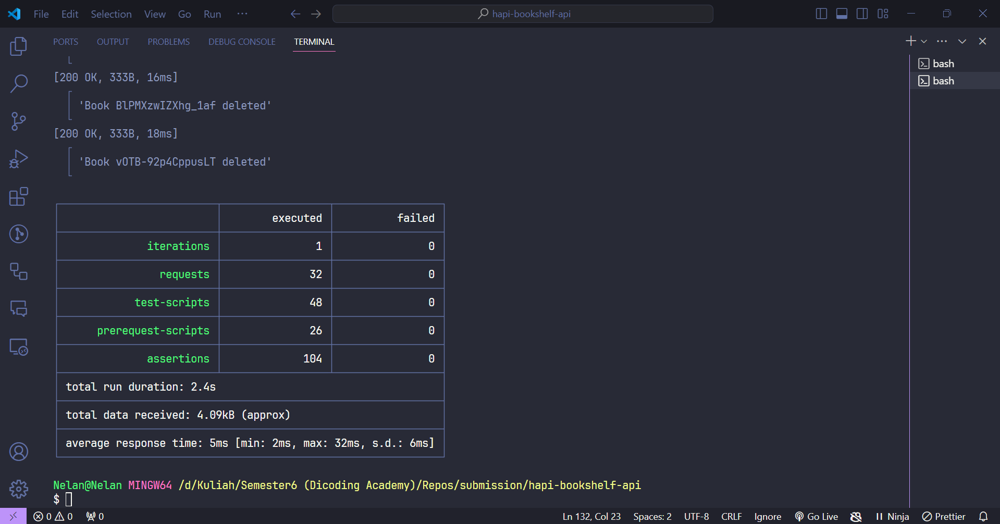

# Bookshelf API

This is a simple bookshelf API that can be used to store and retrieve books.

Please Read the [API Documentation](./docs/book.md) for more information.

## Installation

```bash
yarn install
```

## Running the app (Production)

```bash
yarn run start
```

## Running the app (Development with nodemon)

```bash
yarn run start-dev
```

## Running test with newman

```bash
 npx newman run bookshelf_api_test.postman_collection.json --environment bookshelf_api_test.postman_environment.json
```

### Result testing with newman


